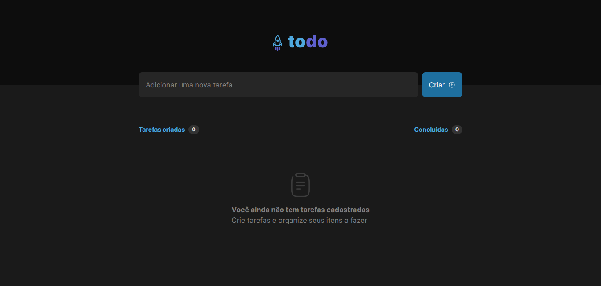

# ToDo List 🗒️



---

## ⭐ Stacks

- [x] Vitejs
- [x] Tailwind CSS
- [x] Phosphor Icons
- [x] classnames

---

## 🖥️ Executando
Clone o repositório com o comando abaixo:
```
git clone https://github.com/rudneyrodrigues/todo-list.git
```

Faça a instalação das dependências do projeto:
```
yarn
```

E execute:
```
yarn dev
```

---

### Contate-me em:
[](https://www.linkedin.com/in/rudneyrodrigues/)
[](https://www.instagram.com/rudney.rodrigues.3/)
[](mailto:contato@rudneyrodrigues.dev.br)
